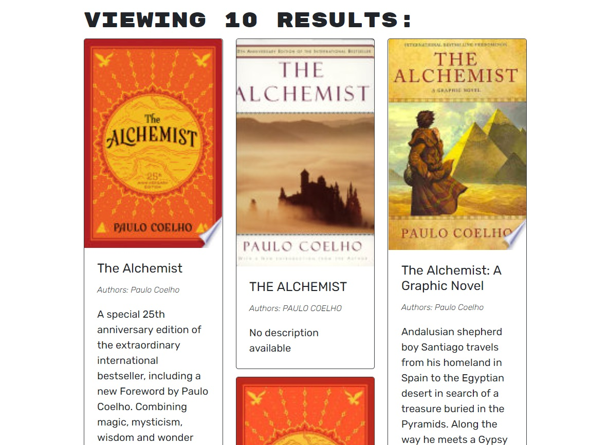

# Book Search Engine
  
  [GitHub Repo](https://github.com/e1m3m0/book-search-engine)

  [Heroku Deployment](https://immense-spire-56989.herokuapp.com/)

  ## Description
  --------------
    
  MERN app that uses Google Books API to search for books and save it to user's list. User's authentication is require to maintain the user data secure. The app uses Node.js and Express.js for the backend server. MongoDB for the NoSQL database, JWT for token creation and authentication, and GraphQL for the routes. The frontend is built with React.

  
  
  
  

  
   
  ## Table of Content
  -------------------

  1.   [Description](#description)
  2.   [Installation](#installation)
  3.   [Usage](#usage)
  4.   [License](#license)
  5.   [Contributing](#contributing)
  6.   [Test](#test)
  7.   [Question](#questions)
  
  ## Installation
  ---------------

  1. Clone repository from GitHub. 2. Run ```npm run install``` on the Root of the project to install dependencies for the React App and Node Server. 3. Start coding!

  ## Usage
  --------

  Access the App [Here](https://immense-spire-56989.herokuapp.com/). Signup using the Signup link. Start searching for books to add to your list.

  ## License
  ---------- 
      
   
  

  Copyright (c) 2021 by Guillermo Mateo. Licensed under the [MIT](https://choosealicense.com/licenses/mit)
  
  ## Contributing
  ---------------
    
  Please refer to each project's style and contribution guidelines for submitting patches and additions. In general, we follow the "fork-and-pull" Git workflow.

  1. **Fork** the repo on GitHub
  2. **Clone** the project to your own machine
  3. **Commit** changes to your own branch
  4. **Push** your work back up to your fork
  5. Submit a **Pull request** so that we can review your changes

  NOTE: Be sure to merge the latest from "upstream" before making a pull request!

  ## Test
  -------
  
  No test available.

  ## Questions

  ### Guillermo Mateo
  *   [GitHub](https://github.com/e1m3m0)
  *   [Email](mailto:gamateo@gmail.com)
